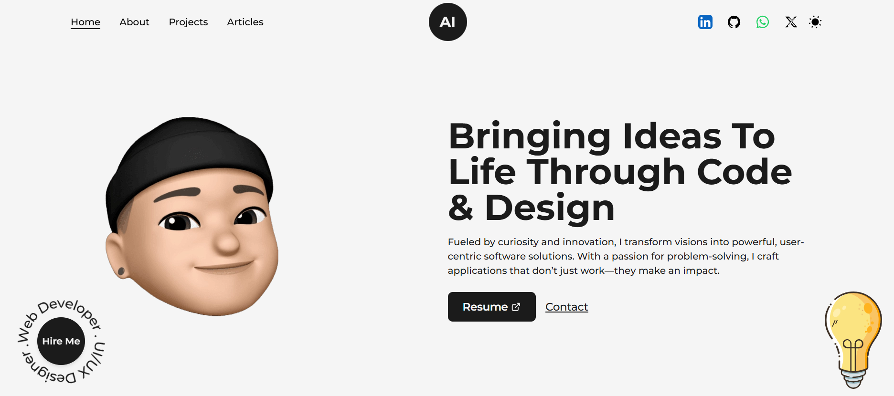

# Personal Portfolio

This is my personal portfolio website, built with Next.js. It showcases my projects, skills, experience, education and contact information through a clean, responsive, and user-friendly interface.

## Overview

This portfolio website provides a centralized place for showcasing my work. It’s designed for potential employers, collaborators, and clients to learn more about me, see examples of my work, and contact me easily. The site is fast, secure, and optimized for both desktop and mobile devices.

## Features

- **About Me**: A brief introduction about who I am and what I do.
- **Projects Showcase**: A gallery of projects with descriptions, technologies used, and live/demo links.
- **Experience Section**: Highlights my professional experience in software engineering, showcasing key roles, responsibilities, and achievements.
- **Education Section**: Displays my educational background and certifications, providing insight into my formal training and qualifications.
- **Skills Section**: A list of my technical skills.
- **Contact Form**: Allows visitors to send me messages directly.
- **Responsive Design**: Optimized for both desktop and mobile devices.

## Technologies Used

- **Framework**: [Next.js](https://nextjs.org/)
- **Styling**: [Tailwind CSS](https://tailwindcss.com/) / CSS Modules
- **Hosting**: [Vercel](https://vercel.com/) for easy deployment and hosting
- **Icons**: Heroicons / Font Awesome

## Resources Used in This Project

- **Fonts**: [Google Fonts](https://fonts.google.com/)
- **Icons**: [Iconify](https://iconify.design/)
- **LightBulb SVG**: [Lukasz Adam Illustrations](https://lukaszadam.com/illustrations)

## External Libraries Used

- **framer-motion**: Used for animations and transitions in the UI.
- **Tailwind CSS**: Utility-first CSS framework for responsive styling.

## Contact

Feel free to reach out if you’re interested in working together or have any questions!

- **Email**: deniranifeoluwa@gmail.com
- **LinkedIn**: [linkedin.com/in/ifeoluwa-adeniran-09183a1ba](https://www.linkedin.com/in/ifeoluwa-adeniran-09183a1ba)
- **Twitter**: [x.com/Adexifeouwa](https://x.com/0x_ifeoluwa)

